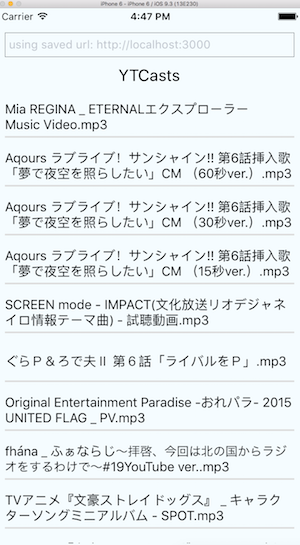

# ytcasts

Because I wanted to download "YoutubeCasts" using youtube-dl without much effort.

Will utterly fail if/when Youtube changes their video page, but whatever. This was easy.

## Installation

Needs youtube-dl, maybe ffmpeg?

Needs a config.json with "targets" with links for Youtube channel video pages.

## Worst API + Mobile client ever

Run the Servant Haskell API server:

`cd serve && stack build && stack exec serve-exe`

Then try out the stupid app:

`cd YTCClient && npm install && react-native run-ios`

Should look like this when you have things installed:

